# Mia's Bakery — Website Project

## Student Information
- **Name:** [Sisanda Martins]
- **Student Number:** [ST10376718]
- **Group:** [NO GROUP]
- **Subject:** [Web Development WEDE5020]

## Project Overview
This repository contains the Portfolio of Evidence (PoE) for the Mia's Bakery website project. Mia's Bakery is a neighbourhood bakery based in Cape Town, South Africa, specialising in freshly baked bread, pastries, and custom celebration cakes. This project takes the website from initial planning (Part 1) through visual design (Part 2) to full functionality and SEO optimisation (Part 3).

## Website Goals and Objectives
- Showcase daily products and custom cakes.
- Allow customers to enquire about custom cake orders.
- Provide trading hours and location details.
- Increase walk-in and online orders.

## Key Features and Functionality
- Home page with hero section and introduction.
- About Us page with bakery history, mission, and vision.
- Products page detailing bread, pastry, and cake offerings.
- Enquiry form for custom cake orders and product questions.
- Contact page with two bakery locations and a contact form.
- Responsive design (added in Part 2).
- Interactive JavaScript features and SEO optimisation (added in Part 3).

## Timeline and Milestones
| Week | Activity |
|---|---|
| 1 | Research and planning |
| 2 | Complete project proposal |
| 3 | Create HTML pages |
| 4 | Apply CSS styling |
| 5 | Add JavaScript functionality |
| 6 | Testing and debugging |
| 7 | Final review and submission |

## Part 1 Details
Part 1 covers project initiation and planning: choosing the target organisation, writing the project proposal, researching and organising content, building the sitemap, and creating the initial HTML structure for all five pages (Home, About Us, Products, Enquiry, Contact Us).

## Part 2 Details
Part 2 focuses on the visual design and responsiveness of the website, and on correcting structural issues identified in the Part 1 HTML.

**Corrections carried over from Part 1 feedback:**
- Fixed an unclosed `` tag in the Home page hero section.
- Replaced an invalid nested `<head>` element in `about.html` with the correct `<header>` element (a `<head>` tag inside `<body>` is not valid HTML and broke the page's document structure).
- Fixed two unclosed `` tags and three malformed `class="price"` attributes in `products.html`.
- Fixed an unclosed `<form>` tag and an unclosed `<select>` tag in `enquiry.html`, and corrected an `<label type="email">` element that should have been an `<input type="email">`.
- Standardised "About Us" capitalisation and corrected a typo in the Products nav link across all pages.

**CSS styling added:**
- Created an external stylesheet (`css/style.css`) linked from every HTML page, using a single consistent filename.
- Added a minimal CSS reset for consistent rendering across browsers.
- Defined a design-token system using CSS custom properties (`:root` variables) for colour palette, typography scale, and spacing scale, so the whole site can be restyled from one place.
- Applied a warm bakery-themed colour palette (roasted-crust brown, cherry-compote red, toasted-crust gold, warm cream) and paired the "Fraunces" display serif with the "Inter" body sans-serif (via Google Fonts).
- Built the page layout using Flexbox (header/nav, highlights list, locations, forms) and CSS Grid (hero overlay, products grid).
- Added interactive states (`:hover`, `:focus-visible`, `:active`) to navigation links, buttons, form fields, and product cards.

**Responsive design added:**
- Implemented two breakpoints using media queries: tablet (`max-width: 900px`) and mobile (`max-width: 600px`).
- Products grid changes from 3 columns (desktop) → 2 columns (tablet) → 1 column (mobile).
- Header/navigation switches from a horizontal row to a stacked layout on mobile.
- Font sizes and spacing reduce at each breakpoint using rem-based custom properties.
- Generated three resolutions (480px / 900px / 1600px wide) of every photograph and implemented `srcset` and `sizes` attributes so browsers download an appropriately sized image instead of the original 4000px+ originals.

## Part 3 Details
*To be completed — JavaScript functionality and SEO optimisation.*

## Sitemap
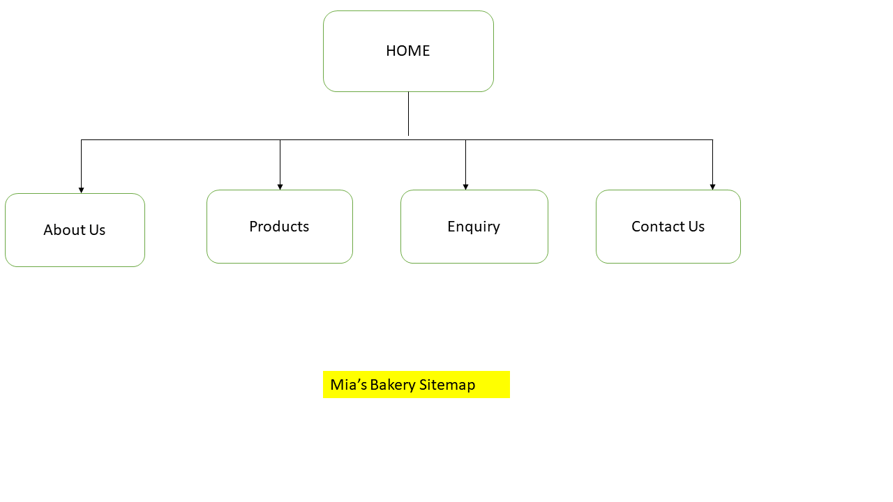

Shared across all five pages:
Home
├── About Us
├── Products
├── Enquiry
└── Contact Us

## Wireframe
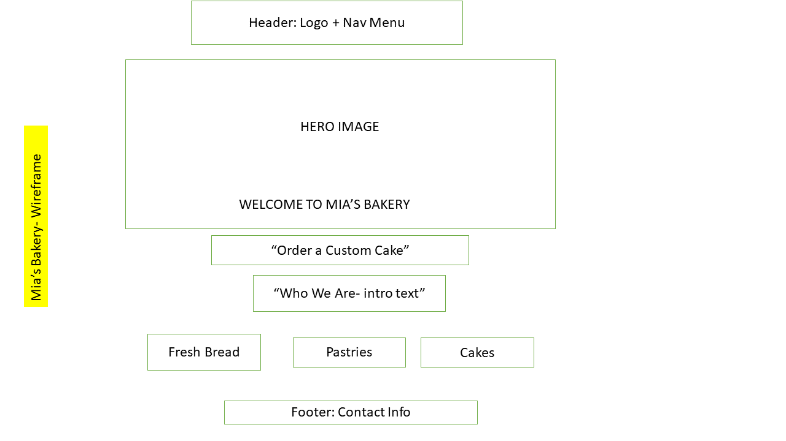

## Responsive Design Testing
Screenshots were captured using Chrome DevTools' device toolbar at three widths: Desktop (1440px), Tablet (768px), and Mobile (375px).
### Home
| Desktop | Tablet | Mobile |
|---|---|---|
| 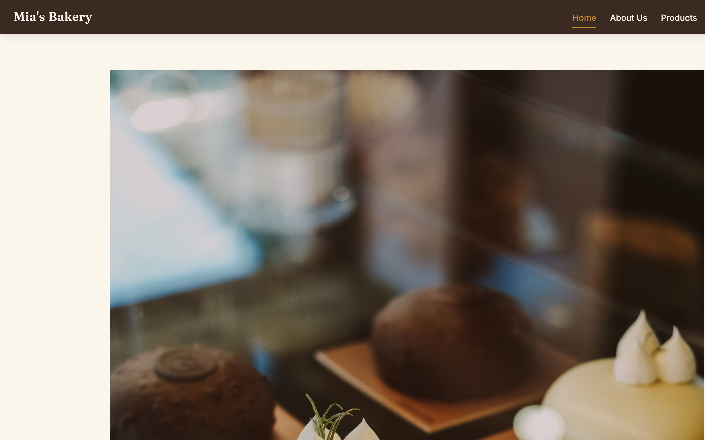 | 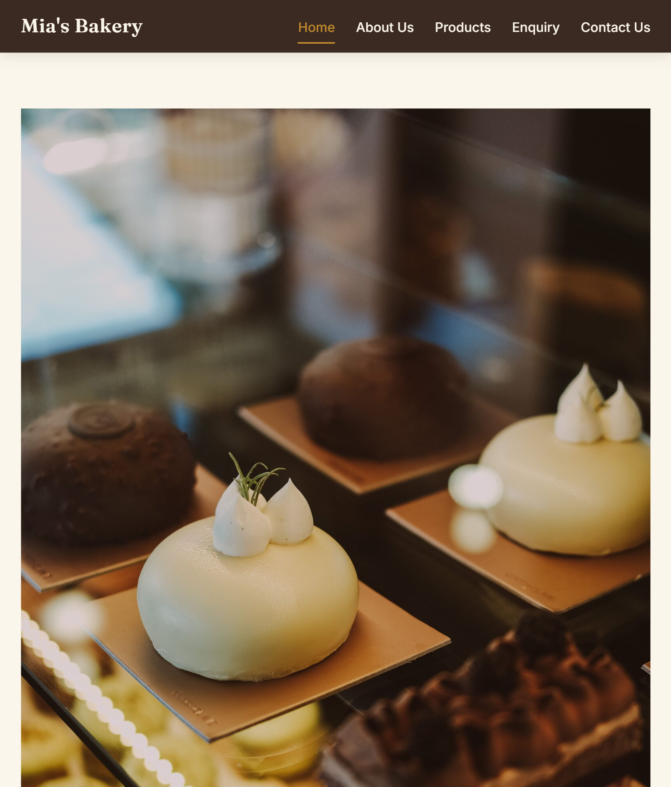 | 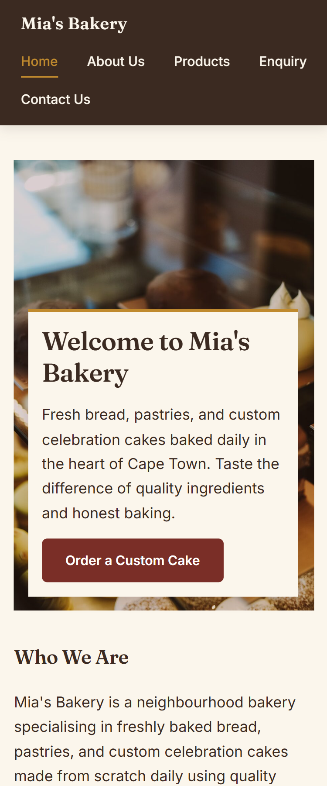 |

### Products
| Desktop | Tablet | Mobile |
|---|---|---|
| 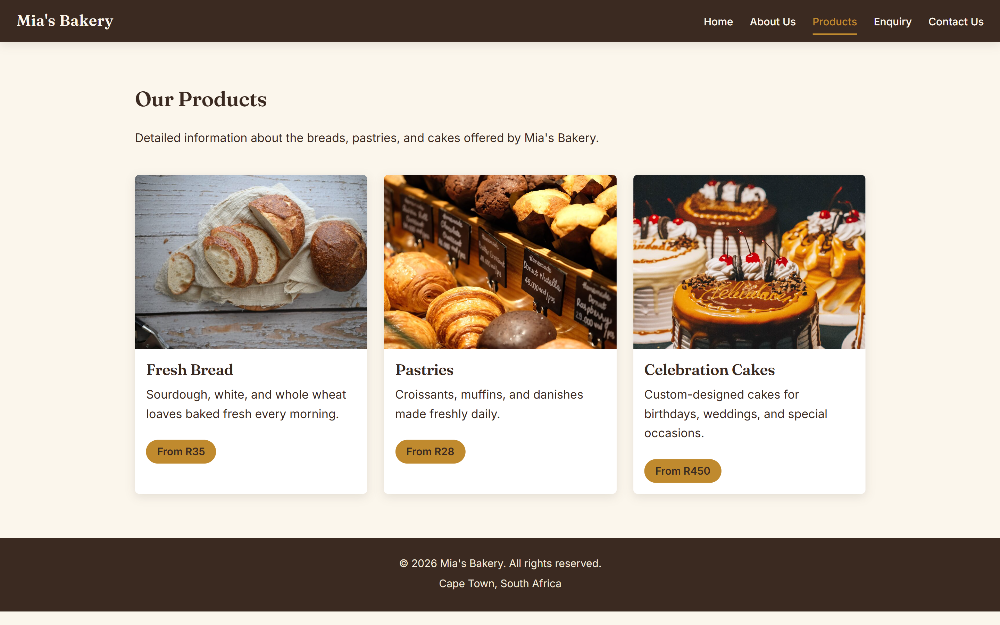 | 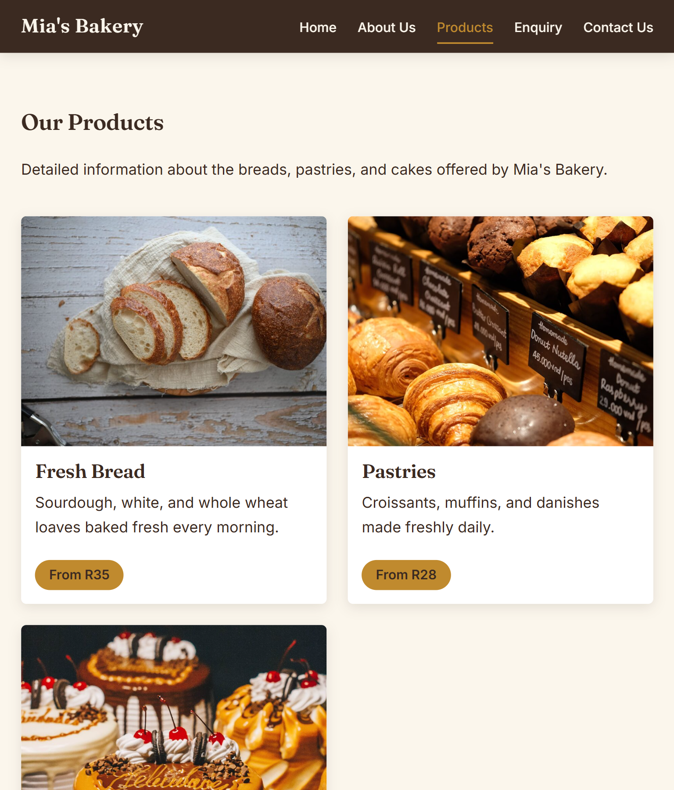 | 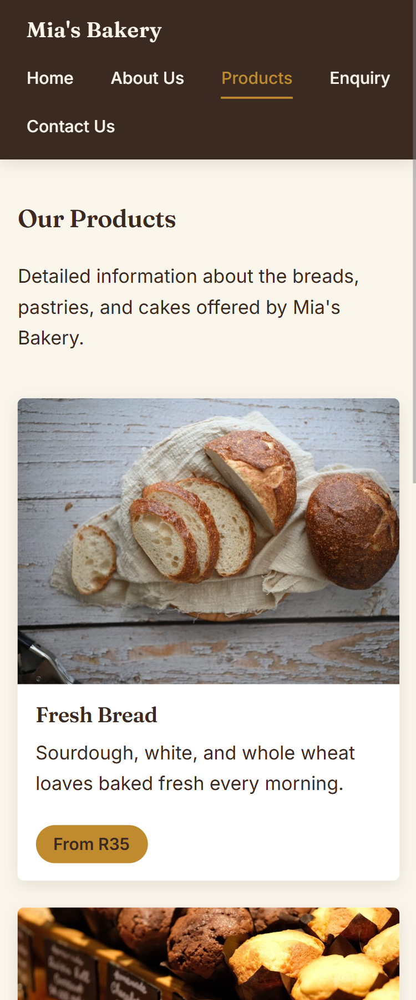 |

### Enquiry
| Desktop | Tablet | Mobile |
|---|---|---|
| 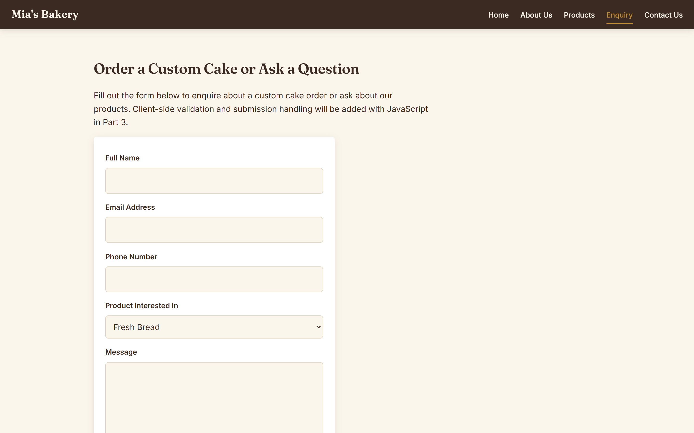 | 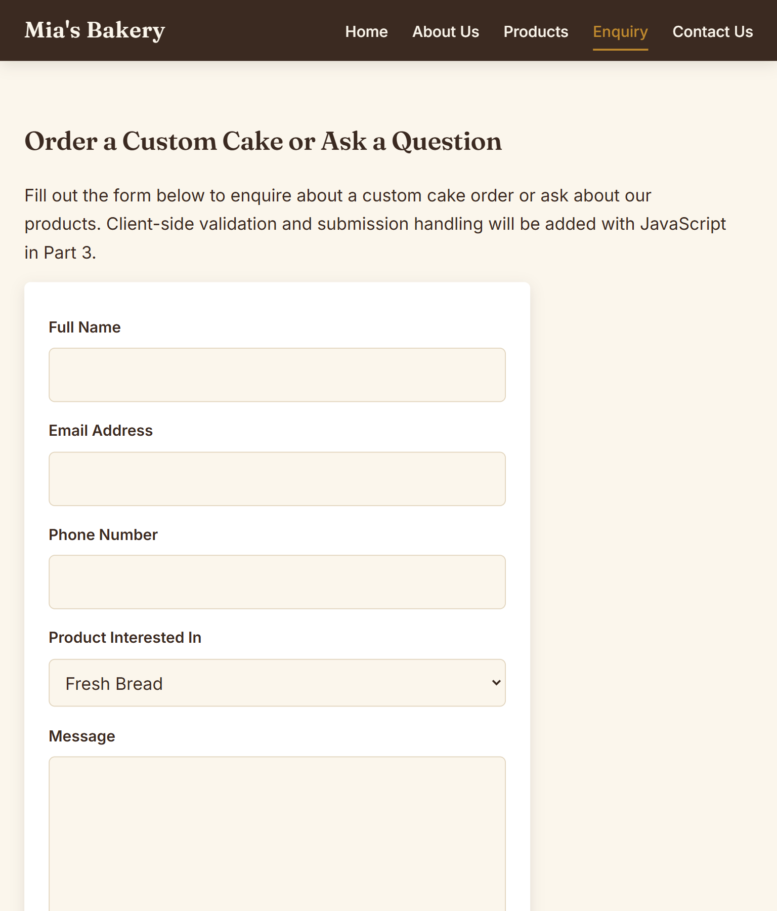 | 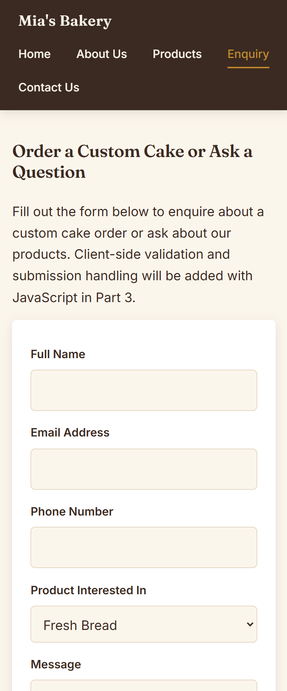 |

### Contact Us
| Desktop | Tablet | Mobile |
|---|---|---|
| 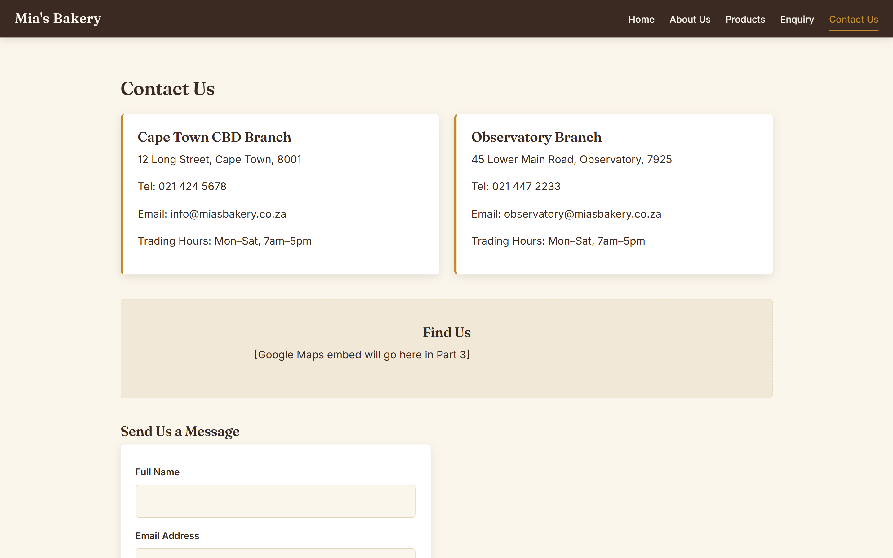 | 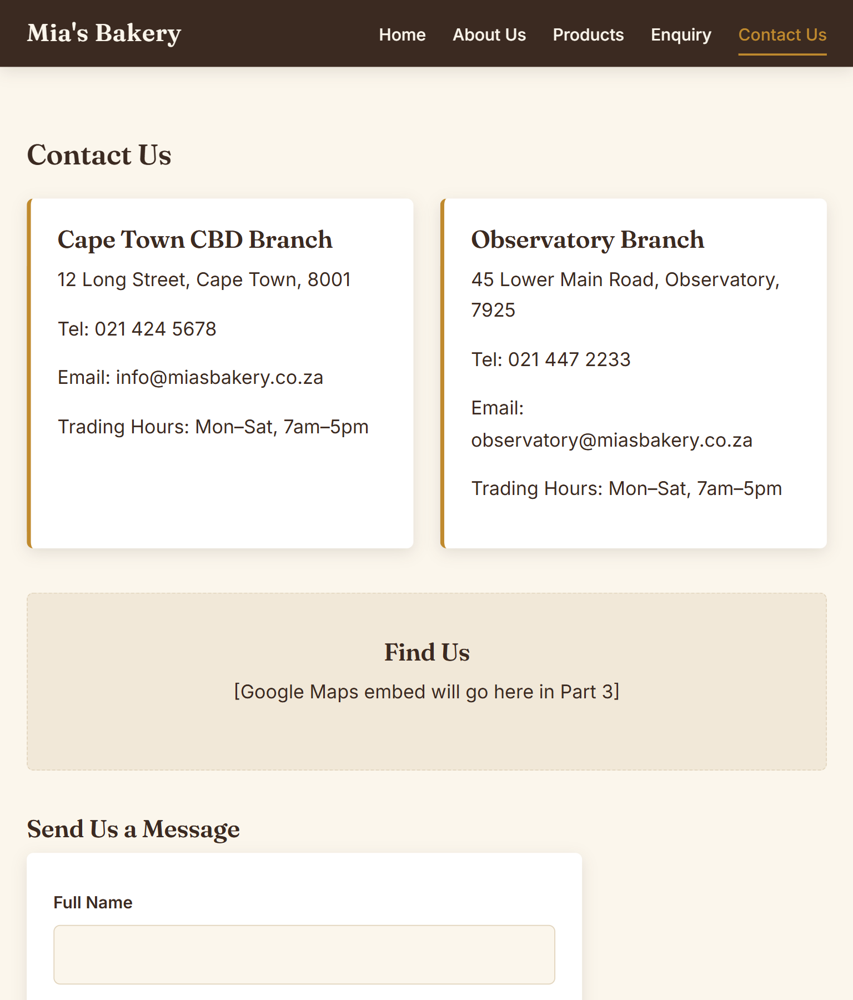 | 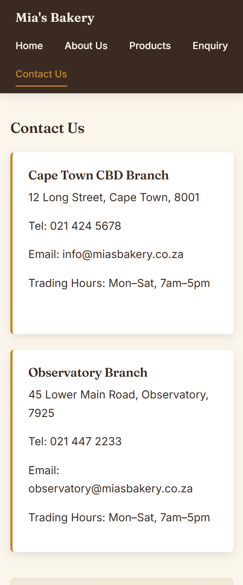 |

## Changelog
| Date | Change |
|---|---|
| [04/08/26] | Initial repository setup and folder structure created |
| [04/08/26] | Created HTML files for all five pages (index, about, products, enquiry, contact) |
| [12/08/26] | Added placeholder content pending final research |
| [28/08/26] | Fixed unclosed `` tag in `index.html` hero section |
| [28/08/26] | Replaced invalid nested `<head>` element with `<header>` in `about.html` |
| [28/08/26] | Fixed two unclosed `` tags and three malformed `class="price"` attributes in `products.html` |
| [28/08/26] | Fixed unclosed `<form>` and `<select>` tags in `enquiry.html`; corrected mislabelled email `<input>` |
| [28/08/26] | Standardised "About Us" capitalisation and fixed "Product" → "Products" nav typo across all pages |
| [28/08/26] | Added `class="active"` to the current page's nav link on every page for a visual "you are here" indicator |
| [28/08/26] | Created external stylesheet `css/style.css` with a CSS reset, design-token custom properties, and base typography, linked from all five HTML pages |
| [28/08/26] | Added Google Fonts ("Fraunces" and "Inter") link tags to all pages |
| [28/08/26] | Built header/navigation, hero, product grid, team card, locations, and form layouts using Flexbox and CSS Grid |
| [28/08/26] | Added `:hover`, `:focus-visible`, and `:active` interactive states to nav links, buttons, product cards, and form fields |
| [28/08/26] | Generated 480px/900px/1600px responsive image versions for all photographs and added `srcset`/`sizes` attributes to reduce page weight on smaller screens |
| [28/08/26] | Added media queries at 900px (tablet) and 600px (mobile) breakpoints; product grid and header layout adapt at each breakpoint |

## References
*(Compile all references used across the Website Project Proposal and Part 1 research here, in Harvard style — IIE adapted)*

- Bynamnamnam, n.d. *Bakery pastries display photograph*. [Photograph]. Pexels. Available at: https://www.pexels.com/photo/29445730 [Accessed: [04/08/26]].
- Eat Kubba, n.d. *Sliced sourdough bread photograph*. [Photograph]. Pexels. Available at: https://www.pexels.com/photo/11842163 [Accessed: [04/08/26]].
- Fatih Guney, n.d. *Bakery display case photograph*. [Photograph]. Pexels. Available at: https://www.pexels.com/photo/17869890 [Accessed: [04/08/26]].
- Oleksandr Plakhota, n.d. *Baker kneading dough photograph*. [Photograph]. Pexels. Available at: https://www.pexels.com/photo/30232344 [Accessed: [04/08/26]].
- Patricio Ledeill, n.d. *Celebration cake photograph*. [Photograph]. Pexels. Available at: https://www.pexels.com/photo/19036040 [Accessed: [04/08/26]].
- Google Fonts, n.d. *Fraunces* [typeface]. Available at: https://fonts.google.com/specimen/Fraunces [Accessed: 28/08/26].
- Google Fonts, n.d. *Inter* [typeface]. Available at: https://fonts.google.com/specimen/Inter [Accessed: 28/08/26].
